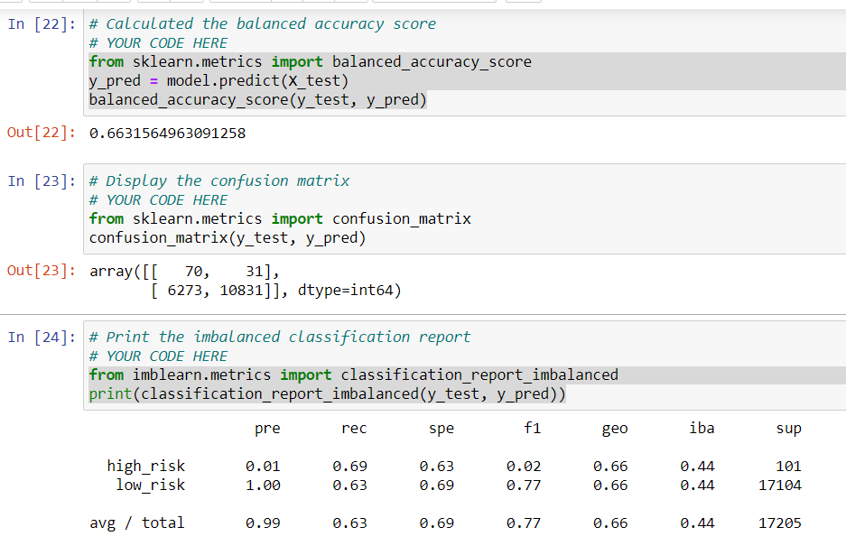
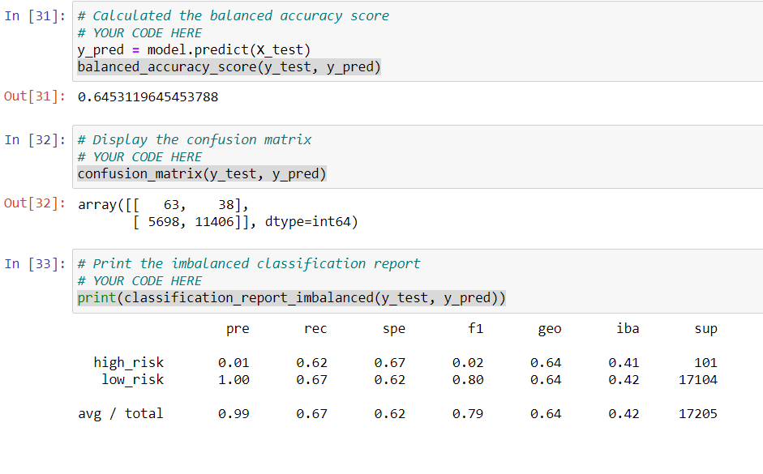
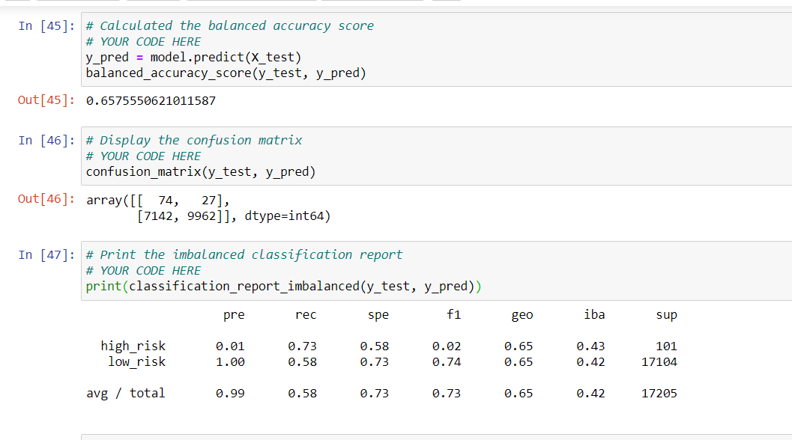
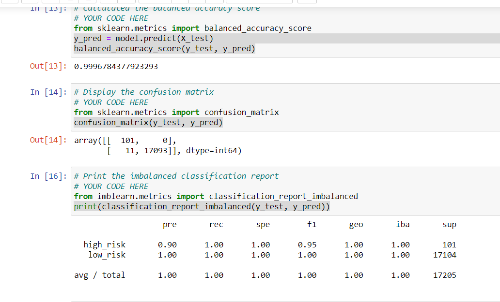
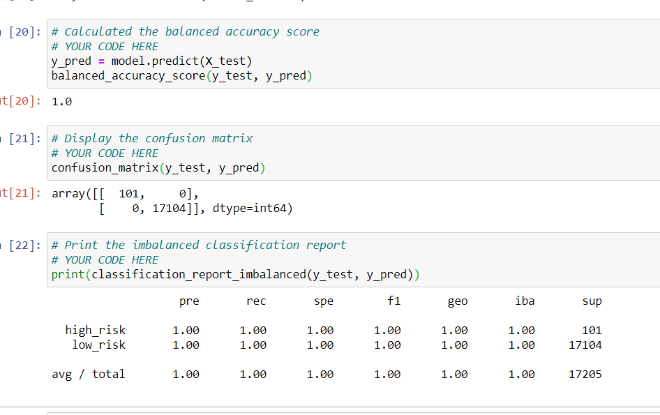

# Credit Risk Analysis

## Overview of the Analysis
The purpose of this analysis is to find an appropriate machine learning algorithm to model the decision making process of ascertaining credit risk.

## Results

### Linear Regression with Resampling

#### Naive Random Oversampling

- Balanced Accuracy: 0.6631564963091258
- Precision: 0.99
- Recall: 0.63

#### SMOTE Oversampling

- Balanced Accuracy: 0.6453119645453788
- Precision: 0.99
- Recall: 0.67

#### Undersampling

- Balanced Accuracy: 0.6453119645453788
- Precision: 0.99
- Recall: 0.67

#### Combination (Over and Under) Sampling

- Balanced Accuracy: 0.6575550621011587
- Precision: 0.99
- Recall: 0.58

### Ensemble Models

#### Balanced Random Forest Classifier

- Balanced Accuracy: 0.9996784377923293
- Precision: 1.00
- Recall: 1.00

#### Easy Ensemble AdaBoost Classifier

- Balanced Accuracy: 1.0
- Precision: 1.00
- Recall: 1.00

## Summary

Overall we have found ensemble learning methods to be more effective over using a linear regression on a resampled training set. I would recommend that we go ahead with using the Easy Ensemble AdaBoost Classifier to model our decision making.
